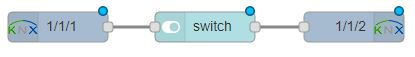

# node-red-contrib-knx-easy
Simple Node-RED nodes for knx.
The input and output nodes is used in a similar way as the built in mqtt nodes.
 


## Input node
Set Group-address and DPT in node config to subscribe to all messages with 
that destination and  msg.payload will contain the value you want.

Listen to values written to address 1/1/1:


You can also suscribe to GroupValue response and GroupValue read events,
this way you can create your own response and send it back to the bus with a knxEasy-out node.

If you need more than the value, extended information is available in the message outputted:   
```
msg = 
    { "topic": "1/1/1"
    , "payload": 0
    , "knx": 
        { "event": "GroupValue_Write"
        , "dpt":"1.001"
        , "dptDetails": 
            { "name": "DPT_Switch"
            ,"desc": "switch"
            ,"use":"G"
            }
        , "source":"2.2.2"
        , "destination": "1/1/1"
        , "rawValue":[0]
        }
    }                        
```
(Read events will have payload and knx.rawValue of null)

## Output node
Set up group address and select DPT in node configuration.
Send your values using msg.payload
This makes it simple to connect the output node directly to a slider or a switch.